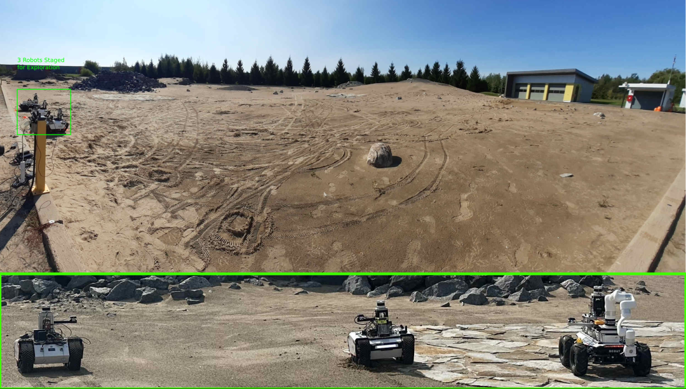

# protobuf 报错
装这个功能包（voxblox rotors-fly）的时候，发现会报 protobuf 版本太老或者太新，导致编译不通过问题。 所以需要卸载已有的 protobuf , 安装对应的版本，即 protobuf-3.6.X，其中 查看版本、卸载与重新安装：
``` bash
protoc --version 
cd /usr/local/include/google
sudo rm -rf protobuf
cd ~/Downloads/protobuf-3.6.x
./autogen.sh
./configure
make
make check
sudo make install
sudo ldconfig
```
# Multi-robot Grid Graph Exploration Planner

The exploration planner builds on top of exsisting planners to enable merging global planning graphs among multiple robots and increases the planning speed by employing grid based local exploration planning.



Local exploration planning graph


Global graph built during exploration planning


## Installation
These instructions assume that ROS desktop-full of the appropriate ROS distro is installed.

Install necessary libraries:

For Ubuntu 20.04 and ROS Noetic:
```bash

sudo apt install python3-catkin-tools \
libgoogle-glog-dev \
ros-noetic-joy \
ros-noetic-twist-mux \
ros-noetic-interactive-marker-twist-server \
ros-noetic-octomap-ros
```


Create the workspace:
```bash
mkdir -p mggplanner_ws/src/exploration
cd mggplanner_ws/src/exploration
```
Clone the planner
```bash
git clone https://github.com/MISTLab/MGGPlanner.git
```

Clone and update the required packages:
```bash
cd <path/to/mggplanner_ws>
wstool init
wstool merge ./src/exploration/MGGPlanner/packages_https.rosinstall
wstool update
```

`Note: ./src/exploration/MGGPlanner/packages_https.rosinstall is for https urls.`

Build:
```bash
catkin config -DCMAKE_BUILD_TYPE=Release
catkin build
```

## Running MGG Planner Simulations 

### Single Robot Simualation

Launching simulation in the pittsburgh mine environment
```bash
roslaunch mggplanner mgg_sim_flat.launch
```
Launching simulation in the darpa cave
```bash
roslaunch mggplanner mgg_sim_darpa_cave.launch
```

### Multi-robot Simulations
To launch three robot simulations:
```bash
roslaunch mggplanner 3smb_sim_mgg.launch
```
In Ubuntu 18.04 with ROS Melodic, the gazebo node might crash when running the ground robot simulation. In this case set the `gpu` parameter to false [here](https://github.com/ntnu-arl/smb_simulator/blob/6ed9d738ffd045d666311a8ba266570f58dca438/smb_description/urdf/sensor_head.urdf.xacro#L20).

## Results

Software Architecture Used During the Deployments


Deployment Arena 


Three robots were deployed in a Mars-analog environment, using the MGG planner to coordinate with one another and distribute across the environment without any predefined exploration preferences.


## References

### Explanation Video
[](https://youtu.be/Fv8B0Ml0KCY)

If you use this work in your research, please cite the following publications:

**MGG planner tests in a Mars analogs environment**
```
@article{vvaradharajan2025,
  title={A Multi-Robot Exploration Planner for Space
Applications},
  author={Varadharajan and Vivek Shankar, Beltrame and Giovanni},
  journal={IEEE Robotics and Automation letters},
  volume = {},
  number = {},
  pages = {},  
  year={2025}
}
```

You can contact us for any question:
* [Vivek Shankar Varadharajan](mailto:vivek-shankar.varadharajan@polymtl.ca)
* [Giovanni Beltrame](mailto:giovanni.beltrame@polymtl.ca)

We acknowledge the contributions of the authors of gbplanner2, and our planner (MGGplanner) has been built on top of gbplanner2's codebase. 
